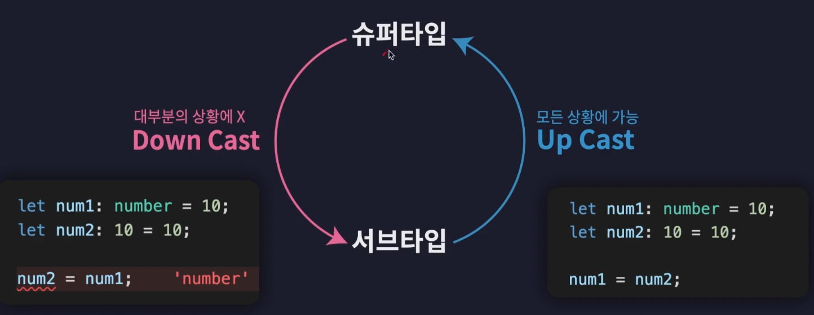

# typescript-inflearn

# 1. 타입스크립트 개론

## 1.1 타입스크립트의 동작원리 및 한계점

## 1.2 시작 (실습)

    - nodeJS 패키지 초기화
        - `npm init`
    - typenode 라이브러리를 설치하기
        -  `npm i @types/node`
        - nodeJS에서 기본적으로 제공하는 기능에 대한 타입이 외부 패키지로 정의되어있다 (console.log 등등)
        - 이게 없다면 타입스크립트의 컴파일 과정에서 기본 노드에서 제공하는 기능들에 대한 타입을 인식하지 못한다
    - typeScript컴파일러 설치하기
       - `npm i typescript -g` (글로벌로 설치)

    - ts파일 컴파일하기
        - `tsc src/index.ts`
            -  컴파일 결과물이 자바스크립트 코드로 생성된다(`src/index.js`)
        - `node src/index.js`
            - 자바스크립트 파일을 실행
        - 근데 매번 이렇게 하기 귀찮은데..?(한번에 실행하기)
            - `npm i tsx`  || (Node20이전이라면) `npm i ts-node -g`
            - `tsx src/index.ts` || (Node20이전이라면)`ts-node src/index.ts`

## 1.3 타입스크립트 설정

- 컴파일러 옵션 파일

  - `tsc --init` (기본 옵션이 들어간 컴파일러 설정 파일 생성 - `tsconfig.json`)

- `incloud`
  - 컴파일 할 타입스크립트 파일의 범위와 위치 설정
- `target`
  - 컴파일 결과 생성되는 자바스크립트 코드의 버전 설정
  - `ES5` or `ESNext`(최신)
  - 구형 브라우저 및 과거 서버환경에서 동작시키기 위해 구버전의 자바스크립트를 사용해야하는 경우가 있다.
- `skipLibCheck`
  - 타입 정의 파일을 스킵 (20버전 이후로 넣어줘야 라이브러리에서 오류 안남)
- `module`
  - 변환되는 자바스크립트 코드의 모듈 시스템을 설정
  - `CommonJS` or `ESNext`(최신)
- `outDir`
  - 컴파일 결과 생성할 JS위치 결정
- `strict`
  - 타입검사 엄격함 설정
- `ModuleDetection`

  - 로컬 모듈로 파일을 설정
  - 일반적으로 타입스크립트의 파일은 전역 파일로 선언되 동일한 변수를 사용할 수 없다
  - `"moduleDetection": "force"` 설정을 통해 각 파일을 로컬 모듈(독립) 으로 취급
  - 또는.. `export {}` 키워드를 각 파일에 넣으면 독립된 모듈로 인식한다.

    - "moduleDetection" 를 넣으면 실제 컴파일된 js파일에 해당 문구가 추가

  - **(package.json) 이때 `type` 설정으로 `module`을 넣어주어야 한다.**
    - 타입스크립트 코드가 ES 모듈 시스템을 사용하는 자바스크립트 코드로 컴파일 되기 때문
    - Node.js가 ES모듈 시스템을 사용할 수 있도록 module설정을 추가해야한다!
  - 실제 React를 사용하는 코드를 봐도, 각 파일을 export형태로 모듈로 처리하고있다. 억지로 두 파일을 만들고 같은 변수를 쓰면 에러가 남

## 2. 타입스크립트 기본

### 2.1 타입스크립트의 타입

- 원시 타입

  - number
    - 숫자(정수,음수,소수) + NaN, Infinity
  - string
  - boolean
  - null
  - undefined

- 리터럴

  - 특정 값 자체를 설정하는게 가능하다.
  - `let numberA : 10 = 10;
  - 'let strA : "test" = "test";`

- 배열

  - `const A : string` === `const A : Array<string>` 같다.

- 튜플

  - **길이와 타입이 고정된** 배열 (JS는 없음)
  - 타입은 배열과 같지만, 고정된 길이도 다음과 같이 지정이 가능하다
    - `const tuple : [number, string, number] = ... `
  - 결국 배열이기에 push, pop과 같이 길이를 무시하고 추가 & 삭제가 가능
  - 배열의 특정 위치에 특정 타입이 보장되어야 할때 용이하다 (순서가 중요할떄)
    - `['name', 20]`

- 객체 (object)
  - 객체 리터럴 타입 : 객체가 가지는 속성을 직접 나열해 만드는 타입
  - `object vs Record<any,any>` - section2-chapter3 정리 볼것

### 2.2 타입 별칭

- 스코프가 다르면 변수와 같이 동일한 타입 선언 가능

### 2.3 인덱스 시그니처

- `[key] : string` 과 같이 키와 값의 타입을 지정
- 인덱스 시그니처와 특정 필드에 대한 타입을 명시하려면 & 연산자 사용하기

### 2.4 Enum

- 숫자형 enum
  - 값을 넣지 않아도 0부터, 할당된 값부터 1씩 증가하며 자동 할당된다
- 문자형 enum

```
  enum Role {
    ADMIN = 10, // 10 할당
    USER, // 11 할당(자동)
    GUEST, // 12 할당(자동)
  }

enum Language {
  korean = "ko",
  english = "en",
}

const user1 = {
  language : Language.korean
  role: Role.ADMIN, //관리자
};


- 1.  enum의 경우 자동으로 숫자가 할당되는 과정에서 의도치않은 접근 예외처리 힘듬
- - 또한 즉시 실행 함수 형태로 코드를 생성하기 때문에 Tree-shaking되지 않는다
-
- 2.  const enum의 경우 별도의 객체가 생성되지는 않는다.
- - 말 그대로 치환하듯 해당 문자열이 삽입됨 (실제 코드를 보면 객체가 안만들어짐)
- - ts에서 --isolateModules 옵션을 사용하면 스코프 문제로 문제가 될 수 있음
- - Object.keys, Object.entries를 이용해서 값들에 대해 순회 불가
-
- 3.  as const
- - 단순 객체형태로 정의되므로 Tree-shaking 가능
- - Object.keys, Object.entries를 이용해서 값들에 대해 순회 가능

-
-
- https://techblog.woowahan.com/9804/

```

### 2.5 any , unknown, void, Never

- unknown
  - any와 유사하지만 메서드, 연산, 변수 할당이 안된다
  - 즉 타입을 좁혀 안전하게 사용해야하고 런타임 에러를 줄일 수 있는 안전한 타입
- void : 어떠한 값도 반환하지 않을 떄
- never : 모순, 불가능을 의미
  - 의도적인 에러 상황을 나타낼때 사용하기도 함

# 3. TypeScript 이해하기

## 3.1 타입과 집합

### 3.1.1 기본타입



- 상위 타입에는 하위 타입을 할당할 수 있다. (반대는 X)

```
  let a: unknown = 1; // number -> unknown
  let b: unknown = "hello"; // string -> unknown
  let a: never = 1; // number -> never ❌
```

### 3.1.2 객체타입

- 객체의 경우에는 속성을 기준으로 집합의 관계가 생성된다
  - 상위 (더 포괄적인) 객체로 업캐스팅이 가능

## 3.2 대수 타입

- Union : `let a: string | number;`
- Intersection : `let variable: number & string; // = never`

## 3.3 타입 추론

- 변수 선언
  - 초기값을 기준으로 타입을 추론
- 함수의 반환 값 (return)을 기준으로
- 기본 값이 설정된 매개변수
- 주의 해야하는 상황
  - 초기값을 생략하면 any로 추론
  - const 상수의 경우 가장 좁은 타입으로 추론된다
    - `const num = 10` // 10 Literal
    - `const str = "hello"` // hello Litiral
  - 여러가지 배열을 가지는 타입 -> union의 추론
    - `const arr = [1,'2']` // (number | string) []

## 3.4 타입 단언

- `as Type` 형태로 사용
- 특정 타입을 정의하였지만 빈 객체로 초기화할때 사용(유틸에서 많이씀)
- 특정 객체에 초과프로퍼티가 있을때 우회하는 용도로 사용 (본 기억이 없긴함..)
- 타입 단언의 조건
  - 두 타입이 슈퍼타입 or 서브 타입일때
- 다중 단언
  - `as unknown as` 사용되는걸 많이 본거같은데?
    - unknown의 경우 모든 유형에 할당이 가능하기 때문에 항상 타입을 정의할 수 있다
    - TODO // 사용 사례 추가

## 3.5 타입 좁히기

- `typeof` , `instanceof` , `in` 과 같은 타입 가드를 사용해 타입을 좁혀 추론
- `typeof value === "object"` 의 경우 `null` 값도 통과 한다.
- `Date` 객체의 경우 `value instanceof Date` 형태로 사용
  - 인스턴스의 경우 위 타입가드를 쓴다.
- 특정 필드값이 있음을 확인할 때에는 `in`을 사용

## 3.5.1 서로소 유니온 타입

- 교집합이 없는 타입으로 만든 유니온 타입

  - 서로 겹치는게 없는 타입
  - 태그 프로퍼티를 통해 타입을 직관적으로 분리하기(서로 포함 관계를 가지지 않도록)
    - 판별 프로퍼티는 값을 나타내는 Unit Type으로 선언되어야 한다
    - `void`, `string`이 아닌 특정 리터럴이나 값
  - ```
        type Admin = {
            tag: "ADMIN";
            name: string;
            kickCount: number;
        };

        type Member = {
            tag: "MEMBER";
            name: string;
            point: number;
        };

        type Guest = {
          tag: "GUEST";
          name: string;
          visitCount: number;
        };
    ```

# 4. 함수와 타입

## 4.1 함수 타입과 표현식

- 함수 타입 표현식

  - `type Operation = (a: number, b: number) => number;`
  - `const add: Operation = (a, b) => a + b;`

- 호출 시그니쳐

  - ```
    type Operation2 = {
      (a: number, b: number): number;
    };

    const add2: Operation2 = (a, b) => a + b;

    ```

## 4.2 함수 타입 호환성

- 반환 값의 타입 호환(공변성 - 업캐스팅)

  ```
  type WideReturn = () => number;
  type NarrowReturn = () => 10;

  let witeReturn: WideReturn = () => 10;
  let narrowReturn: NarrowReturn = () => 10;

  witeReturn = narrowReturn; // ✅
  ```

- 매개변수 값의 타입 호환(반공변성 - 다운 캐스팅)
  - 매개변수의 값이 더 구체적일때
  - 매개변수의 개수가 더 많을 때

```
type WideParam = (value: number) => void;
type NarrowParam = (value: 10) => void;

let wideParam: WideParam = (value) => {};
let narrowParam: NarrowParam = (value) => {};

narrowParam = wideParam; // ✅
```

- 어떤 함수가 매개변수로 any를 받아서 내부에서 any로 할 수 있는 여러 매서드를 사용한다면 결국 any보다 더 좁은 타입의 매개변수를 받는 함수는 호환될 수 없다.

- 반대로 좁은 타입의 매개변수를 받아 내부 로직을 처리하는 함수에 대해서, 더 많은 매개변수를 허용해도 상관없다. 어처피 좁은 타입의 매개변수는 호환될 수 있으니까
